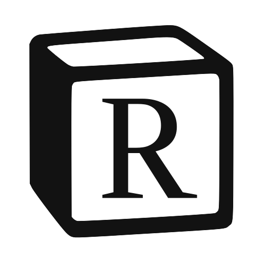
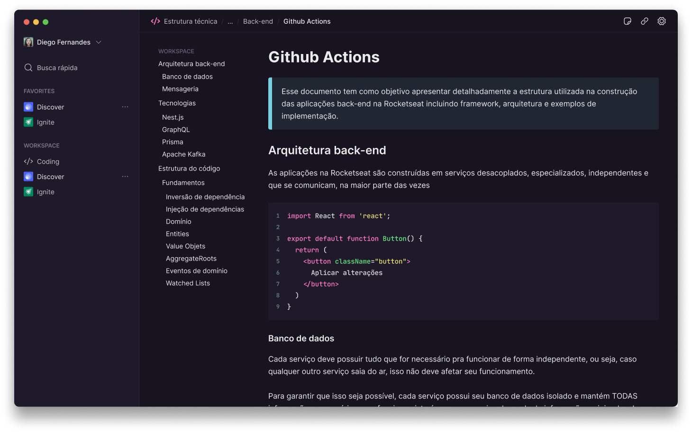

<h1 align="center">
  
</h1>

<h4 align="center">A fake notes app inspired by Notion.</h4>

<p align="center">
  
  
  
  <a href="https://www.linkedin.com/in/caiotracera/">
    
  </a>
  <br />
  <a href="https://github.com/caiotracera/rotion/commits/master">
    
  </a>
  <a href="https://github.com/caiotracera/rotion/issues">
    
  </a>
  
  
</p>

<blockquote align="center">
“Never doubt yourself. We are all capable of amazing things.”
</blockquote>

<p align="center">
  <a href="#rocket-about-the-project">About the project</a>&nbsp;&nbsp;&nbsp;|&nbsp;&nbsp;&nbsp;
  <a href="#man_technologist-technologies">Technologies</a>&nbsp;&nbsp;&nbsp;|&nbsp;&nbsp;&nbsp;
  <a href="#wrench-getting-started">Getting started</a>&nbsp;&nbsp;&nbsp;|&nbsp;&nbsp;&nbsp;
  <a href="#memo-license">License</a>&nbsp;&nbsp;&nbsp;
</p>

<div align="center">
  
</div>

# :rocket: About the project

<b>Rotion</b> is a fake notes app inspired by Notion made with Electron. The goal of this project is to put into practice all the knowledge acquired in relation to this technology, as well as the entire ecosystem of React.

# :man_technologist: Technologies

* Electron
* React.js
* React Query
* IPC

# :wrench: Getting started

To run this project locally, you must have installed <a href="https://nodejs.org/en/" target="_blank">Node.js</a>
and <a href="https://git-scm.com/" target="_blank">Git SCM</a>. In addition, you must be able to run the Android or iOS emulator in your machine.

<b>Clone the project</b>

```shell
$ git clone https://github.com/caiotracera/rotion
$ cd rotion
```
<b>Install dependencies</b>

```shell
$ npm install
```

<b>Start the project</b>

```shell
$ npm run dev
```

# :memo: License

Made with :sparkling_heart: by Caio.
<br />
:coffee: Can we have a coffe? <a href="https://www.linkedin.com/in/caiotracera/">Get in touch!</a>
